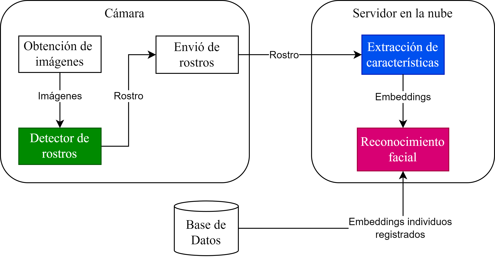
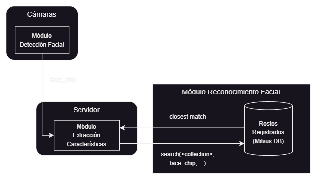
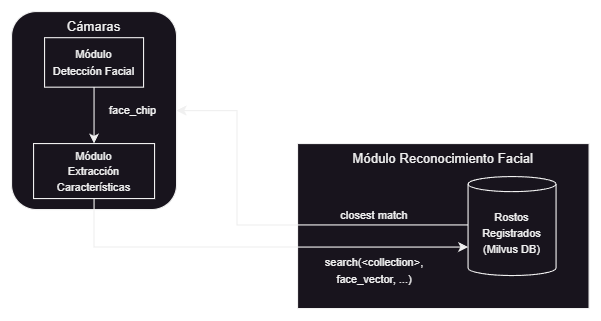

# SPRIA (Sistema de Prevención de Robos con Inteligencia Artificial)
Sistema que utiliza reconocimiento facial para detectar el ingreso de "mecheros" hacia los locales y prevenir posibles "robos hormiga".
La idea principal es implementar 3 módulos: detección facial, extracción de las características faciales y reconocimiento facial.

## Concepto de arquitectura


## Arquitecturas del sistema propuestas



## MDF: Módulo de detección facial
Dlib implementa 2 modelos para este objetivo:
1. Histograma de Gradientes Orientados (HOG):
    - Para la implementación en particular de Dlib, es necesario utilizar imágenes que contengan rostros con unas dimensiones mínimas de 80 x 80 píxeles.
    - HOG es más rápido que la implementación DNN, dado que ésta última tiene buenos desempeños utilizando una GPU de alto rendimiento.
2. Deep Neural Network (DNN)

### Cómo compilar MDF

```
cd FaceDetectionModule
mkdir build
cd build
cmake ..
cmake --build . --config Release
```

## MEC: Módulo de extracción de características
A partir de la información obtenida en la etapa anterior (detección facial), se procesa el rostro para obtener un vector o encoding que contenga su información para que pueda ser utilizada por el módulo de reconocimiento facial. 

Dlib dispone de un modelo CNN pre-entrenado para este módulo.

### Cómo compilar MEC

```
cd FaceFeatureExtractionModule
mkdir build
cd build
cmake ..
cmake --build . --config Release
```

## MRF: Módulo de reconocimiento facial
Finalmente se compara el encoding anterior con aquellos registrados en la base de datos, típicamente se utiliza la **distancia euclidiana (L2)** para determinar la distancia entre los vectores (mientras menor la distancia, más el parecido entre los rostros). Sin embargo, se puede utilizar métodos integrados en base de datos especializadas en el almacenamiento de vectores para realizar esta operación. Por el momento, se está haciendo uso del **Vector Search** de [Milvus DB](https://milvus.io/docs/overview.md) para implementar este módulo.

## MTV: Módulo de transmisión de vectores (o imágenes)
La idea es utilizar una base de datos vectorial y que ésta se haga cargo de realizar la comparación entre encodings (VSS). Para lograr lo anterior, se debe transmitir los embeddings desde el computador que obtiene dicho vector y enviarlo a la base de datos, esto se puede lograr utilizando **Web Sockets** o **ZeroMQ**. Es posible utilizar una API que comunique a los clientes (cámaras) con el servidor (base de datos). Sin embargo, es probable que no tenga un buen rendimiento (en prueba).
